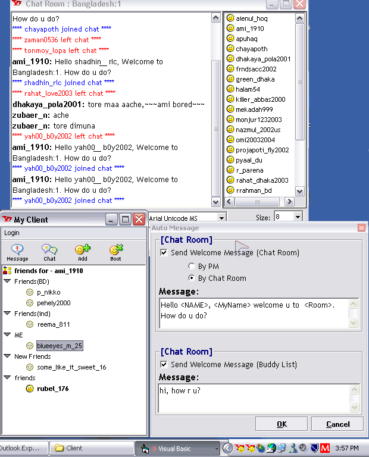



## Yahoo\! \(Chat \+ Auto Message\)

### Description

After many requests for chat support, i finally decide to update my previous ver: "Yahoo! Client + Booter V2.0".

In this release, Chat-Room Support and Auto-Message feature is added. Using this Auto-Message u r now able to send message to ur friends(in the buddy list) when they come online. You can also able to send message to the new commer in the chat room ur currently in by using PM/Chat Room. In chat room auto-message, you can use three variable:

<Name> , <MyName>, <Room>. Please see the screen shot for details.

Again, like the previous release you need the Ymsg5log.dll. However this .dll is free.

Another issue is "compatibility issue", Just follow the steps:

1. Make the DLL for SSubTimer6 first.

2. Change the reference of prjIconMenu from SSubTimer6 to the newly created dll.

3. Make the DLL for prjIconMenu.

4. Now change the reference of Yahoo(prjNewYahooClient) to the newly created dll from prjIconMenu.

5. Now you can make Yahoo.exe

If anyone likes this code, plz let me know. If you get any error plz plz let me know about it. And Don't forget to rate the code.
 
### More Info
 

             |
---                |---
**Submitted On**   |2003-07-24 13:45:56
**By**             |[Blue Eyes](https://github.com/Planet-Source-Code/PSCIndex/blob/master/ByAuthor/blue-eyes.md)
**Level**          |Advanced
**User Rating**    |5.0 (25 globes from 5 users)
**Compatibility**  |VB 5\.0, VB 6\.0
**Category**       |[Complete Applications](https://github.com/Planet-Source-Code/PSCIndex/blob/master/ByCategory/complete-applications__1-27.md)
**World**          |[Visual Basic](https://github.com/Planet-Source-Code/PSCIndex/blob/master/ByWorld/visual-basic.md)
**Archive File**   |[Yahoo\!\_\(Ch162359832003\.zip](https://github.com/Planet-Source-Code/blue-eyes-yahoo-chat-auto-message__1-47172/archive/master.zip)

